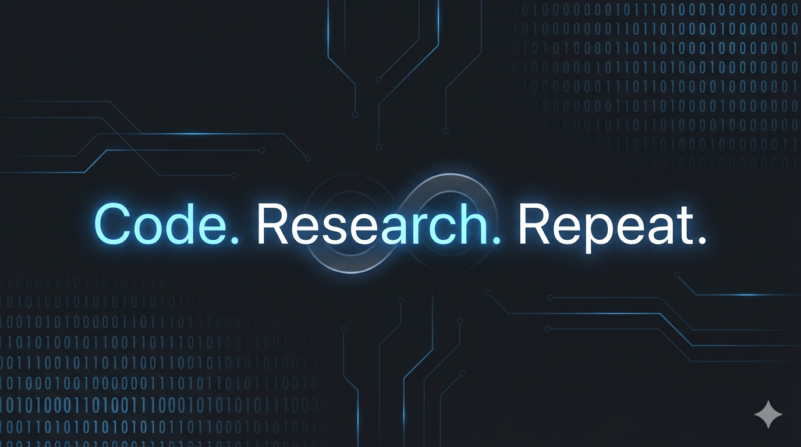

  <h1>Hi there! I'm Kamran, a Full Stack Engineer 👋🚀</h1>
  
🚀 MERN & PERN Specialist | Problem Solver | Open Source Contributor

  

    
  

## 

### 💫 About Me

I am a passionate **Full Stack Developer** specializing in building highly scalable, performant, and real-time web applications. I love diving into complex system designs and optimizing architecture from frontend layouts down to deployment containers.

- 🔭 **Currently focusing on**: Advanced backend architectures, microservices, and open-source contributions.
- 🧠 **DSA Enthusiast**: Constantly refining problem-solving skills through Data Structures & Algorithms.
- ⚡ **Real-Time Systems**: Experienced in engineering low-latency data pipelines and real-time synchronization.
- 🌱 **Learning**: Exploring AI/ML integrations with web applications.
- 💬 **Ask me about**: Full Stack Development, System Design, and Open Source.
- 📫 **How to reach me**: [kamrandarman72@gmail.com](mailto:kamrandarman72@gmail.com)
- 🌐 **Portfolio**: [kamran.dev]([https://kamran.dev](https://kamrandarman.vercel.app/))

---

### 🛠️ Tech Stack & Skills

<table>
  <tr>
    <td valign="top" width="50%">
      <h4>🌐 Frontend & Languages</h4>
      <ul>
        <li><b>Languages:</b> JavaScript (ES6+), TypeScript, C++ / Java, Bash, Python</li>
        <li><b>Frameworks:</b> React.js, Next.js</li>
        <li><b>State & Styling:</b> Redux Toolkit, Tailwind CSS, HTML5 / CSS3, GSAP, Framer Motion</li>
      </ul>
    </td>
    <td valign="top" width="50%">
      <h4>⚙️ Backend & DevOps</h4>
      <ul>
        <li><b>Server-Side:</b> Node.js, Express.js, GraphQL, REST APIs</li>
        <li><b>Real-Time:</b> Socket.io</li>
        <li><b>DevOps & Tools:</b> Docker, Kubernetes, Nginx, CI/CD, Git</li>
        <li><b>Databases:</b> PostgreSQL, MongoDB, Redis</li>
      </ul>
    </td>
  </tr>
</table>

---

### 📊 GitHub Analytics

  
  
  

---

### 🌐 Connect with Me

  
  
  
  

---

---

### 🎨 Fun Fact

I love creating digital art and animations in my free time!
